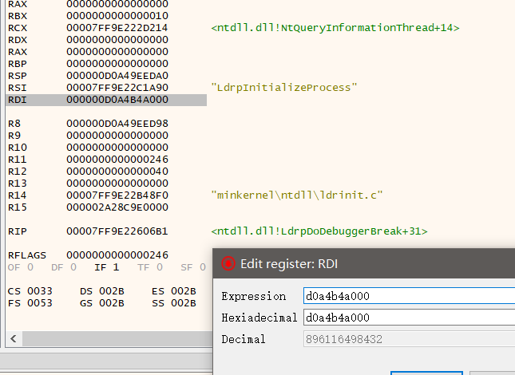
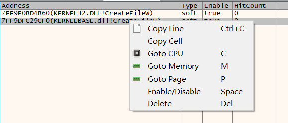
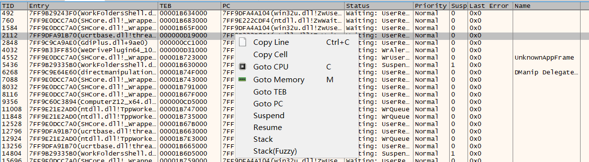
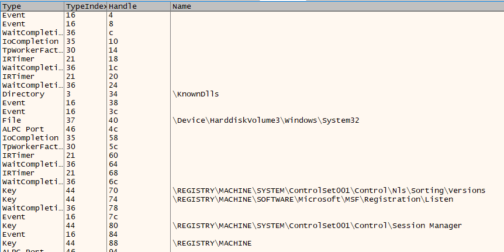
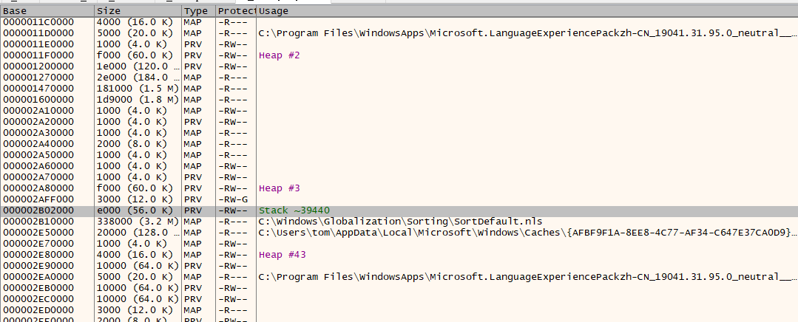
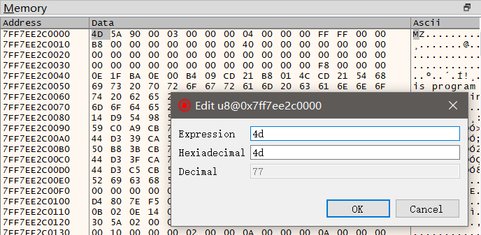
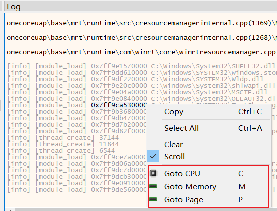

# 基本功能

## 启动调试器

1. 双击 udbg.exe 直接启动，调试器内附加调试目标
2. 命令行带参数启动；常用命令行：
  - `udbg` 启动udbg，并显示主窗口，相当于在资源管理器中双击udbg.exe进行启动
  - `udbg -W` 无窗口启动udbg，在命令行中调试
  - `udbg -e test.lua` 启动udbg并执行 test.lua 脚本
  - `udbg -e test.lua --watch` 监控 test.lua 脚本改动并**自动执行**
  - `udbg notepad.exe` (默认的调试引擎) 创建并调试 notepad.exe
  - `udbg notepad.exe -- test.txt test2.txt` (默认的调试引擎) 创建并调试 notepad.exe，传递**命令行参数** `test.txt test2.txt`
  - `udbg -a notepad.exe` (默认的调试引擎) 附加到 notepad.exe
  - `udbg -A uspy notepad.exe` 通过uspy调试引擎 创建并调试 notepad.exe
  - `udbg -A uspy -a notepad.exe` 通过uspy调试引擎 附加到 notepad.exe
  - `udbg -o explorer.exe` 打开explorer.exe进程，不调试
  - `udbg -r localhost:2333` 连接到udbg-server，并启动，后面可跟上面所有的参数，参考 [远程调试](#远程调试)

完整的命令行语法如下

    udbg 0.1.0
    metaworm

    USAGE:
        udbg.exe [FLAGS] [OPTIONS] [--] [ARGS]

    FLAGS:
        -a, --attach       Attach target
        -h, --help         Prints help information
        -W, --no-window    Dont show the main window
        -o, --open         Open the target, not attach
        -p, --pid          Target as pid
            --version      Prints version information
        -V, --verbose      Show the verbose info
        -w, --watch        Watch the executed lua script

    OPTIONS:
        -A, --adaptor <adaptor>          Specify the adaptor [default: ]
        -r, --remote <address:port>      Connect to udbg server, with cui [env: UDBG_SERVER=]
            --cwd <directory>            Set CWD for target
        -e, --execute <lua path>         Execute lua script
        -c, --config <udbg config>...    Set the __config

    ARGS:
        <target-path>    Create debug target
        <args>...        Shell Arguments to target

## CUI && GUI

如果不加任何参数启动udbg，默认会显示udbg窗口，工作于GUI模式下；`udbg -W`启动udbg会工作于CUI模式下，其实窗口也创建了，只不过没有显示；
可通过`Alt+;`快捷键来切换GUI模式和CUI模式；

GUI模式下可以方便直观地查看调试目标的各种数据，可以交互式调试/执行命令，一般也是工作在GUI模式下；
CUI模式用于纯命令行交互，或者执行脚本时方便查看输出(比如vscode中编辑保存脚本，即可在下方地终端窗口中查看输出)

>! CUI模式下在进行命令输入时，会阻塞`log`系列函数地输出

### 快捷键

CUI & GUI 通用
- `F7` 单步步进
- `F8` 单步步过
- `F9` 继续运行(未处理异常)
- `Shift+F9` 继续运行(已处理异常)
- `Ctrl+F9` (单步)运行到返回

GUI：
- `F12` 中断目标

CUI:
- `Ctrl+D` 中断目标

### CUI、GUI切换

- `Alt+;` 在CUI、GUI之间切换(隐藏主窗口)
- `Alt+/` 从GUI切换到CUI界面(不隐藏主窗口)

### GUI功能简介

1. CPU窗口：反汇编 & 寄存器
  - 反汇编窗口中，双击跳转指令可跳到对应的地址，`F2`启用/禁用/删除断点；`Ctrl+G`可以输入地址表达式并跳转到对应地址
  - `Backspace` 上个地址 `Ctrl+Enter` 下个地址
  - 寄存器窗口中，双击寄存器数值可以修改对应的寄存器 
2. 模块视图：显示已加载的模块，右侧显示该模块加载的符号
3. 断点视图
   
   线程视图 
   句柄视图 
   内存布局视图 
4. 内存视图：
  - `Ctrl+1` `Ctrl+2` `Ctrl+3` `Ctrl+4` 分别切换BYTE WORD DWORD QWORD显示
  `Ctrl+F`切换float显示
  `Ctrl+D`切换double显示
  `Ctrl+G`可以输入地址表达式并跳转到对应地址
  - 双击可以编辑内存 
5. 日志&命令：日志视图展示调试日志、命令输出
  - 快捷键`Atl+.`定位到命令输入框，可以执行一些命令，调试命令参考`script/udbg/command`目录下的lua文件
  - 命令输入框内`Ctrl+R`键可以弹出历史记录并补全
  - 日志窗口内选中一个地址，右键菜单可以快速跳到 CPU/内存/内存页 

## 断点

设置断点最简单的方法是在反汇编视图中，选择对应汇编语句，按`F2`键

但如果想设置更复杂的断点需要使用`bp`命令，列几个常用的断点设置示例
- 常规断点 `bp CreateFileW` 在 CreateFileW 函数处下断点
- 日志断点 `bp CreateFileW wstr(reg[1])` 在 CreateFileW 函数处下断点，并显示第一个参数
  - 其中`wstr(reg[1])`是一个lua表达式，表示需要记录的内容，`reg[1]`表示当前架构下标准调用约定的第一个参数(x64下相当于`reg.rcx`)，可跟多个表达式比如 `bp CreateFileW wstr(reg[1]) reg.rdx`
  - 如果想过滤需要记录的日志，可加`-f`参数+lua表达式，比如 `bp CreateFileW wstr(reg[1]) -f v1:find'log.txt'`可以过滤带有log.txt的路径，其中v1表示CreateFileW后面的表达式列表里的第一个表达式的值
- 条件断点 `bp CreateFileW wstr(reg[1]) -c v1:find'log.txt'` 当CreateFileW的第一个参数路径包含 log.txt 时断下
- 硬件断点 `bp CreateFileW -t e1` 临时(一次性)断点 `bp CreateFileW --temp`

bp命令的完整帮助 `bp -h`

    bp                                        设置断点
        <address>       (string)              断点地址
        <vars...>       (optional string)     变量列表

        -n, --name        (optional string)   断点名称
        -c, --cond        (optional string)   中断条件
        -l, --log         (optional string)   日志表达式
        -f, --filter      (optional string)   日志条件
        -s, --statistics  (optional string)   统计表达式
        -t, --type        (optional bp_type)  断点类型(e|w|a)(1|2|4|8)
        --tid             (optional number)   命中线程
        --temp                                临时断点
        --symbol                              转换为符号
        --hex                                 十六进制显示
        --caller                              显示调用者
        -m, --module                          模块加载断点

如果需要了解bp命令的详细实现方式，参考`script/udbg/command/bp.lua`

## 远程调试

远程调试需要将`udbg-server.exe` `lua54.dll` `plugin/` 放到远程机器上，然后启动`udbg-server.exe`开始监听；server启动后会显示所监听的IP和端口，默认是*0.0.0.0:2333*，可以通过命令行修改

客户端执行`udbg -r <IP:端口>`连接到`udbg-server`，连接成功后，会显示调试窗口，后续的命令/脚本都是在远程机器上运行的，包括attach窗口显示的进程也都是远程机器上的进程

*`script/udbg/`目录下大部分lua文件都是在远程进程中运行的，只有`script/udbg/client/`目录下的是只能在客户端运行的*

# 扩展功能

## Windows内核

以管理员身份运行`udbg -A krnl -o 4`可以查看Windows内核

*依赖驱动driver.dll，需要自己加过期签名*

## 进程信息查看

udbg支持非侵入式调试，通过`udbg -o <PID/ProcessName>`可打开正在运行的进程，但并不进行调试

在此模式下可以查看进程内存、反汇编、模块符号、线程、句柄等信息，但不能下断点，还可使用内存搜索系列的命令搜索内存

## VEH调试器

通过`udbg -A uspy`来指定使用VEH调试引擎

VEH调试引擎除了可以支持标准调试引擎的断点功能外，还可以在目标进程内执行lua脚本，调用通过lua的libffi调用目标进程内的函数，对目标进程任意函数进行Hook

TODO: uspy