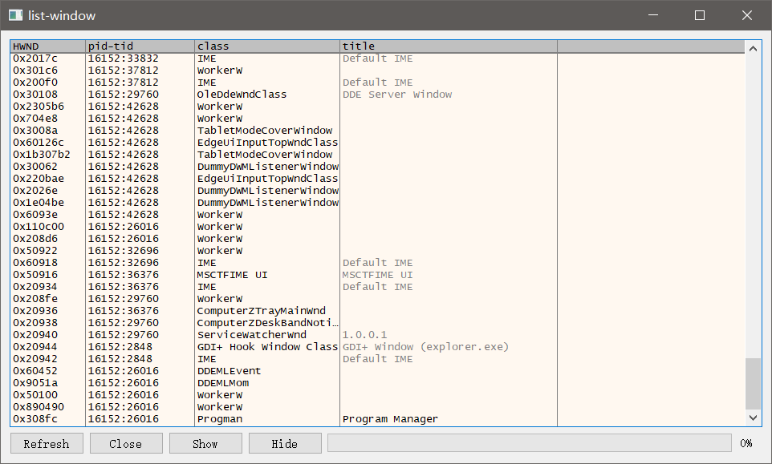
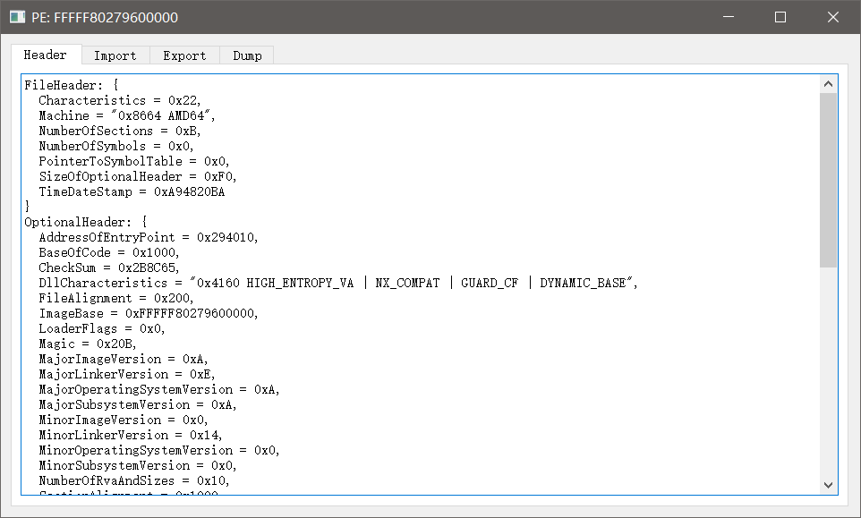
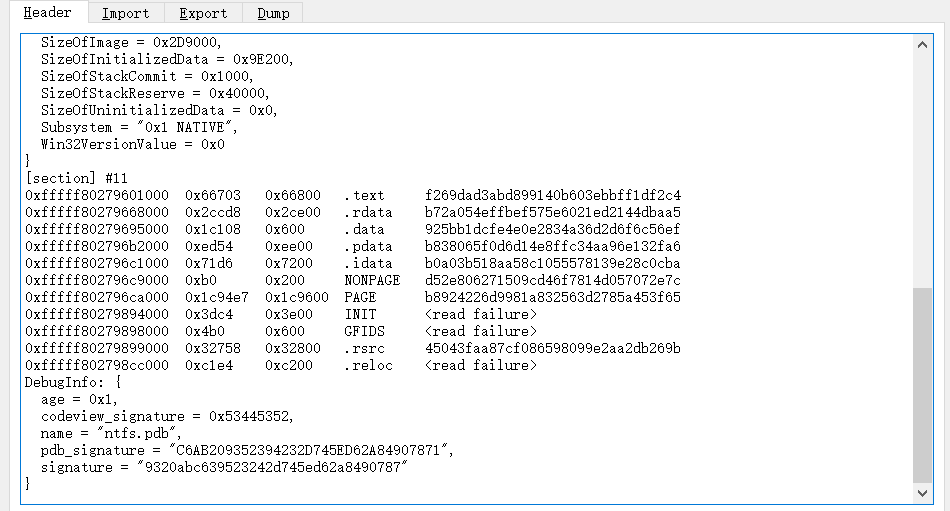
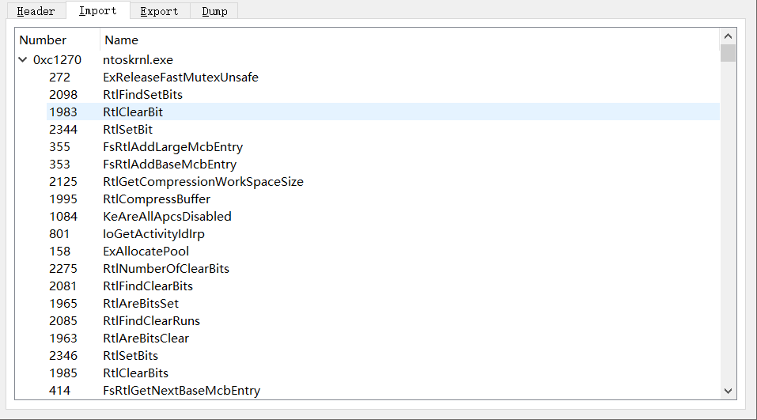
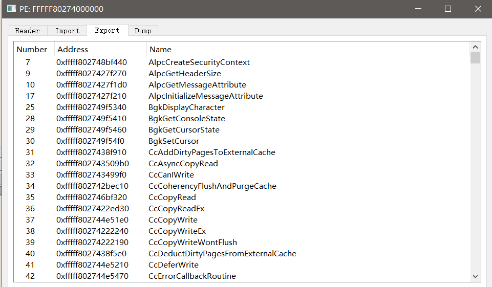
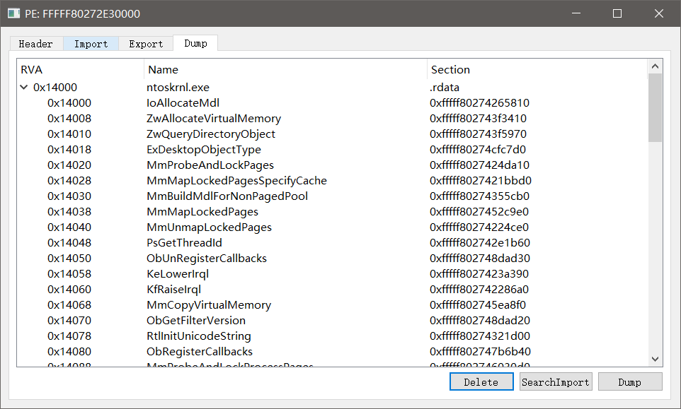

# 插件功能

本文介绍udbg自带实现的插件功能

插件大部分功能都由lua实现，或者lua配合第三方功能模块实现

## 窗口列表

该插件其实是个命令`list-window`，由**lua+ffi**实现，也有相应的菜单入口，源码位于`script\udbg\command\list-window.lua`

## PE View

解析内存中PE镜像，目前只展示了一些基本数据，源码参考`script/udbg/client/__init.lua`中的`.pe-view`命令的实现

 

## Dump PE

将内存中的PE镜像转储到文件，便于后续的静态分析；该功能集成到了PE View界面中，支持扫描导入表，编辑导入表

## PDB文件下载

从微软官网下载所需的pdb符号文件，该功能依赖**powershell的Invoke-WebRequest**命令

源码参考`script/udbg/client/__init.lua`中的`.download-pdb`命令的实现
- 可以在模块列表中右键选择`Download PDB`来下载某一个模块的pdb文件
- 执行`.download-pdb *`命令下载所有模块的pdb

>! 需要在[配置脚本](./config.html)中配置符号缓存路径

## 内存搜索(yara)

## 汇编/反汇编